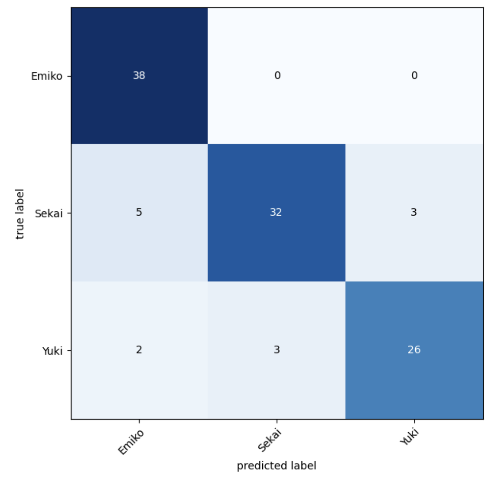
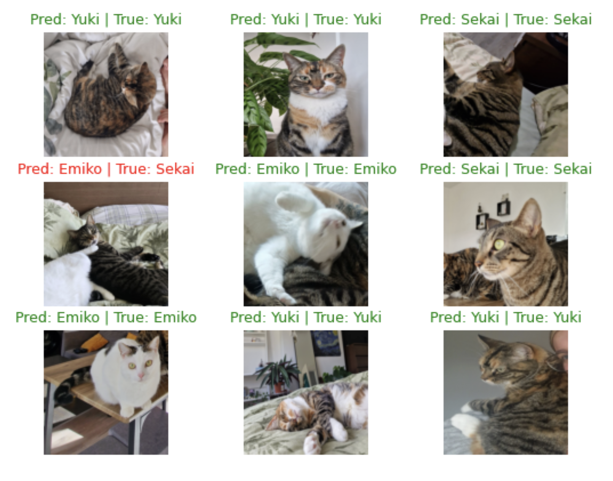
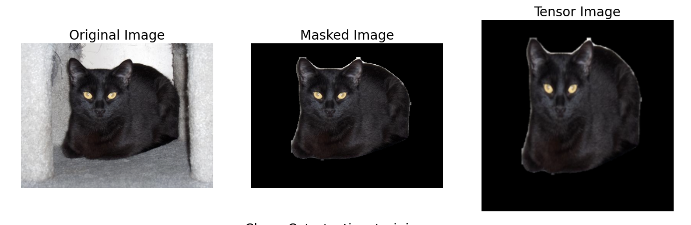
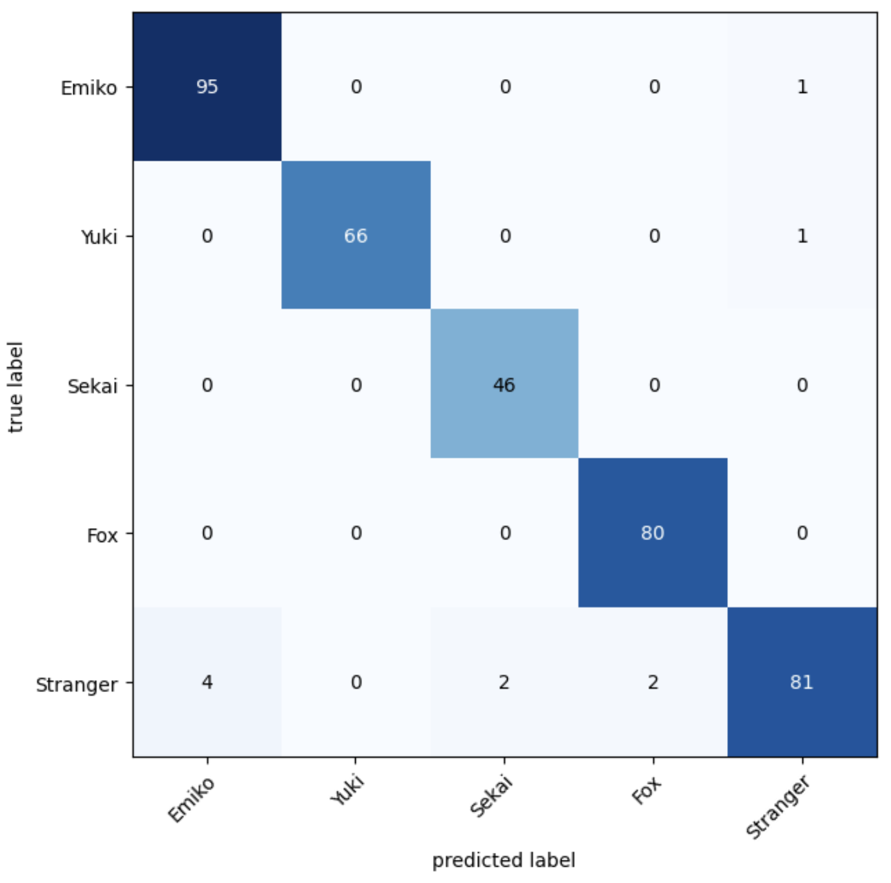
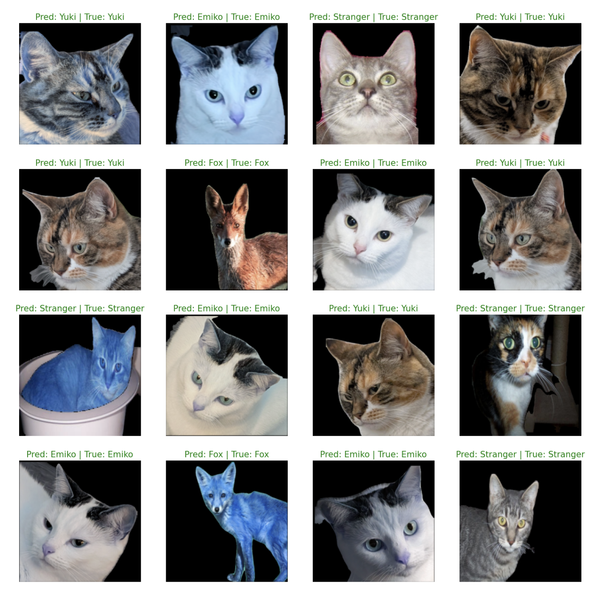

# House Cat Vision 
## Fine-tuning pre-trained models for computer vision tasks

This repository currently stores two programs that I developed to test how accurately I could train a CNN (Convolutional Neural Network) to recognise house cats.

## First project - CNN_models

The starting idea was to train a model from scratch to recognise 3 house cats. I personally took the pictures used to train these models, which explains why I did not get as many as a standard dataset has.
Nonetheless, I applied data augmentation techniques to increase the number of available pictures for the 3 classes.

I started the project by training a model from scratch, whith a customised architecture, which yielded unsatisfactory results.
After training over 10 differernt models with different parameters, the best accuracy achieved on the test set was **75%**.

At that point I decided to try and use a pre-trained model, to see if it could compensate for the lack of pictures in the dataset.
Without much surprise, the pre-trained model reached a greater macro-average accuracy for the 3 classes of **88.51%**.
This simply shows how much better pre-trained models are at dealing with lack of training data.

### Best model Confusion Matrix

### Best model test on pictures

## Second project - using pre-trained models *and* masks

This project improved upon several areas compared to the first project:

1) The dataset had more pictures,
2) A mask was used to higlight the cats in each picture, rendering black the background,
3) The pictures for the dataset were carefully cropped one at a time to mainly include the face of the cats,
4) More classes were added to the dataset: stranger cats, which is a collection of random cats, and foxes.

### The goal of the project

The idea behind this project was to build a CCTV systems that would open a cat door connected to the door to the garden when one of the house cats would approach it. In this case, since many other cats go around my garden and foxes can show up from time to time, it was essential to teach the model to correctly indetify my cats from other cats and foxes.

### YOLO, Model fine-tuning and results

I used `yolov8m-seg.pt` to detect the cats in the pictures and the segments around them. I then proceded to use these segments to black out anything beyond these points, successfully highlighting the subject of each picture.

I used the weights from the **EfficientNet B0** model, which has over 4 billiob parameters, but to fine-tune it I only had to train around 6400.
Training 3 models with different hyperparameters already yielded incredibly better results compared to the previous project. 
## Best Macro-average accuracy reached: **97.39%**.

### Best model Confusion Matrix

### Best model test on pictures

